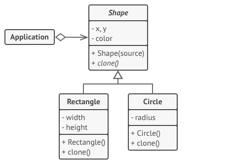

# Prototype Design Pattern

## Definition

Prototype is a creational design pattern that lets you copy existing objects 
without making your code dependent on their classes.

## Example
### Cloning of shape classes

The example provided implements clone() method in order to provide the exact deep copy 
of an object. Also, we use equals() method to compare.
In the program we clone object and do two checks: if objects are the same instance (should not) and
if they are exact copy (should). 

There is also cached option. We create several shapes at the initialization of cache,
and later we allow to pick one initialized shapes and make a copy of it for later use.
In this way we can produce (clone) as many objects of the same characteristics as we need.

## Other

- Example is from awesome website [Refactoring Guru](https://refactoring.guru)